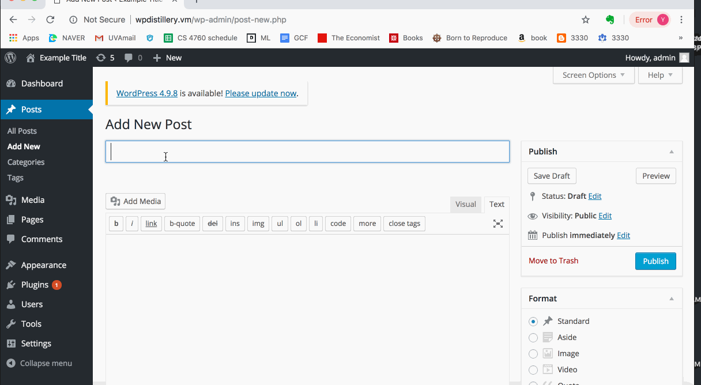
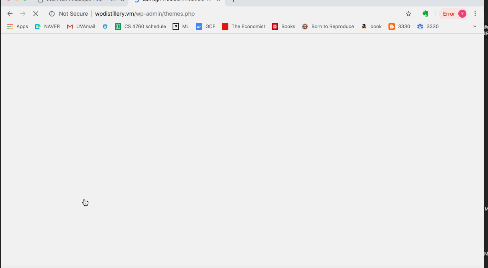
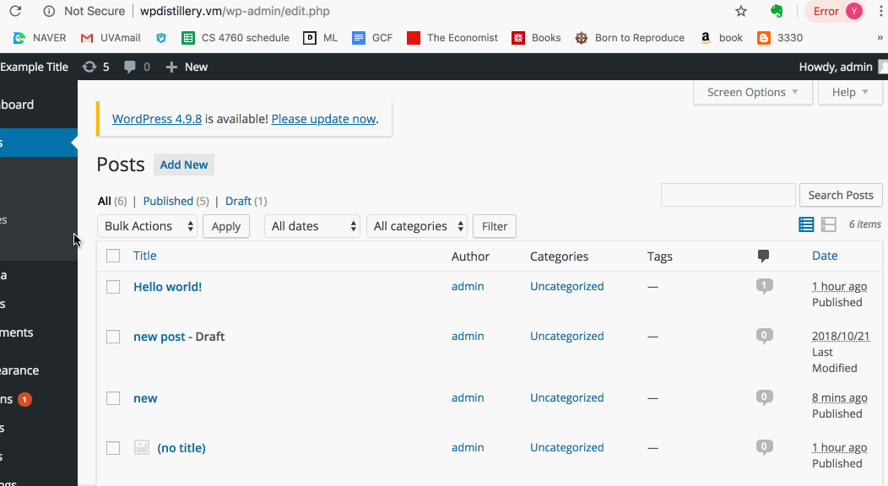

# network-sec

# Project 7 - WordPress Pentesting

Time spent: **5** hours spent in total

> Objective: Find, analyze, recreate, and document **five vulnerabilities** affecting an old version of WordPress

## Pentesting Report

1. (Required) Vulnerability Name or ID
  - [ ] Summary: Authenticated Stored Cross Site Scripting
    - Vulnerability types: XSS
    - Tested in version: 4.2
    - Fixed in version: 4.2.3
  - [ ] GIF Walkthrough: 
  - [ ] Steps to recreate: Create a new post. Make the post title <a href = “” onmouseover=alert(‘xss’)> new</a> and publish the post. Click preview to see the code being executed in the pop up box.
  - [ ] Affected source code:
    - [Link 1](https://core.trac.wordpress.org/browser/tags/4.2/src/wp-includes/default-widgets.php)
1. (Required) CVE 2015-5733
  - [ ] Summary: 
    - Vulnerability types: XSS
    - Tested in version: 4.2
    - Fixed in version: 4.2.4 
  - [ ] GIF Walkthrough: 
  - [ ] Steps to recreate: Create a new menu by clicking on Appearance - Menus. Name the menu, go to "current link", enter a url and use the following script for the url text: , which will pop up as soon as you save it.
  - [ ] Affected source code:
    - [Link 1](https://core.trac.wordpress.org/browser/tags/4.2/src/wp-admin/js/nav-menu.js)
1. (Required) Authenticated Stored Cross-Site Scripting
  - [ ] Summary: 
    - Vulnerability types: XSS
    - Tested in version: 4.2
    - Fixed in version: 4.2.3
  - [ ] GIF Walkthrough: 
  - [ ] Steps to recreate: Create a new post. Go to "Text" and enter the following XSS code and publish the post. Click preview to see the code being executed in the pop up box.
  - [ ] Affected source code:
    - [Link 1](https://core.trac.wordpress.org/browser/tags/version/src/source_file.php)

## Assets

List any additional assets, such as scripts or files

## Resources

- [WordPress Source Browser](https://core.trac.wordpress.org/browser/)
- [WordPress Developer Reference](https://developer.wordpress.org/reference/)

GIFs created with [LiceCap](http://www.cockos.com/licecap/).

## Notes

As I was trying to determine which vulnerabilities were exploitable by me, I went on some false leads trying to exploit vulnerabilities that were too difficult for me to exploit.

## License

    Copyright [yyyy] [name of copyright owner]

    Licensed under the Apache License, Version 2.0 (the "License");
    you may not use this file except in compliance with the License.
    You may obtain a copy of the License at

        http://www.apache.org/licenses/LICENSE-2.0

    Unless required by applicable law or agreed to in writing, software
    distributed under the License is distributed on an "AS IS" BASIS,
    WITHOUT WARRANTIES OR CONDITIONS OF ANY KIND, either express or implied.
    See the License for the specific language governing permissions and
    limitations under the License.
